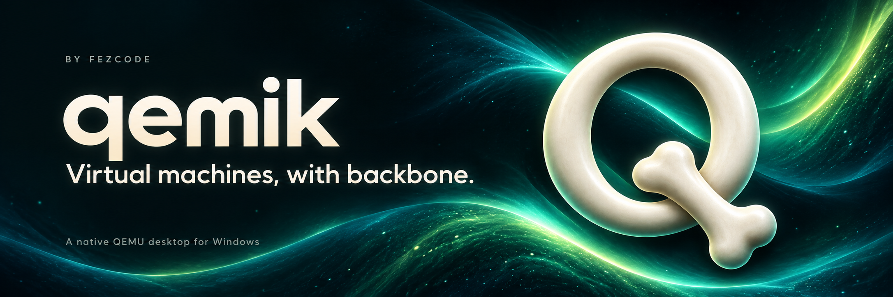
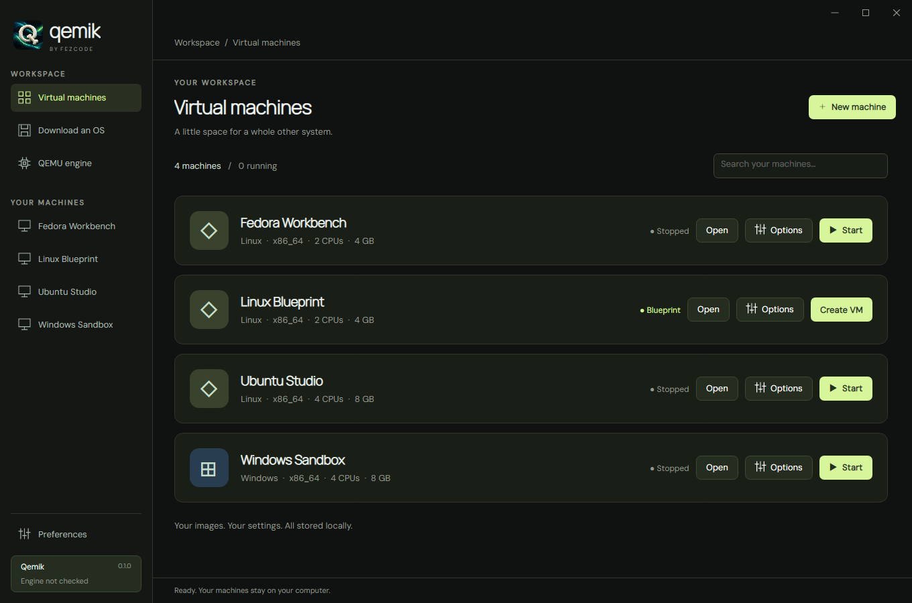
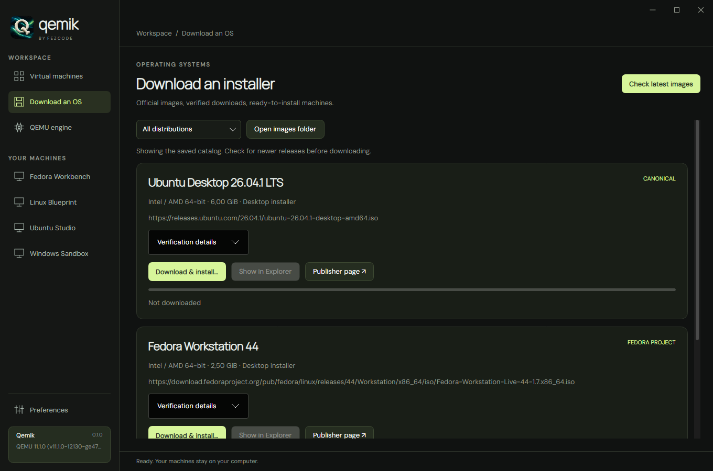
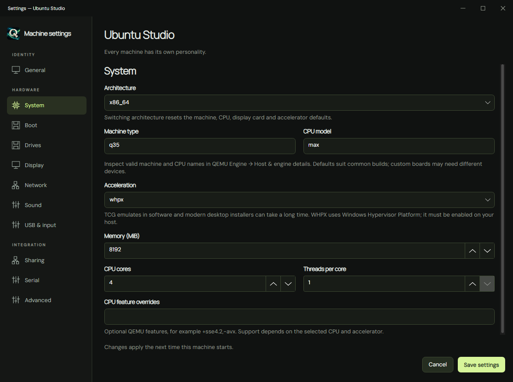
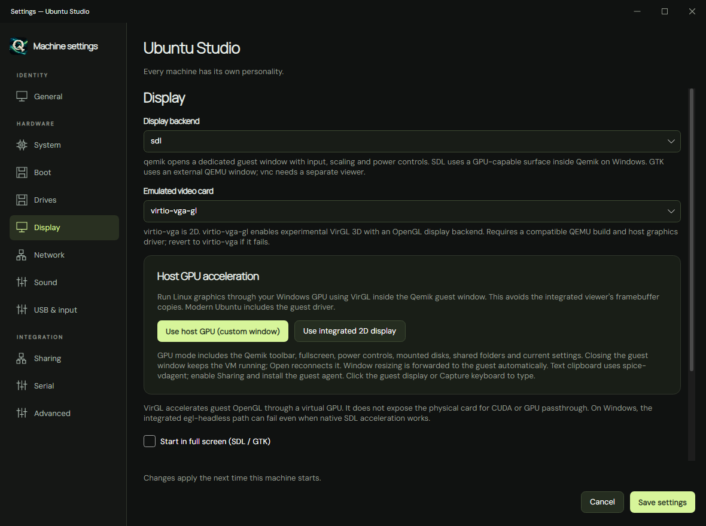

<div align="center">

**A native QEMU desktop for Windows.**

Create a Linux workspace. Keep a Windows sandbox. Give an old system another life.

**Windows x64** · **C# / .NET 10** · **Avalonia 12** · **SQLite**

[Get started](#get-started) · [Explore the app](#a-home-for-every-machine) · [Guest integration](#make-the-guest-feel-at-home) · [Usage guide](docs/usage.md) · [Build & contribute](#build--contribute)

</div>

---

Qemik brings QEMU's flexibility into a native desktop interface inspired by UTM,
using Airlift's C# and Avalonia technology stack. Machines, settings, installation
media, and guest controls live together in one local workspace.

The name is a play on **QEMU + kemik**, the Turkish word for **bone**.

## A home for every machine



*Actual application UI with fictional demo data. Documentation screenshots contain no personal accounts or local directory paths.*

| Your workflow | What Qemik brings |
| :--- | :--- |
| **Create & organize** | Searchable library, Linux and Windows templates, configuration import/export, and per-machine options. |
| **Install an OS** | Official Linux image discovery, resumable downloads, checksum verification, and installer mounting. |
| **Tune the hardware** | CPU, memory, firmware, storage, networking, graphics, sound, USB, and advanced QEMU arguments. |
| **Work inside the guest** | Dedicated display, keyboard input, text clipboard, automatic resolution requests, and fullscreen. |
| **Keep a starting point** | Turn a stopped VM into a blueprint and create independent copies with fresh machine IDs and MAC addresses. |
| **Stay in control** | Pause, shut down, reset, inspect running settings, manage mounted media, and open logs. |

## From download to first boot

Choose Ubuntu, Fedora, Linux Mint, openSUSE, or Debian from **Download an OS**.
Qemik retrieves publisher metadata, verifies the download, and attaches the ISO
to a new or existing machine. You complete installation in the guest.



*Catalog shown with sample metadata; use **Check latest images** for current publisher releases.*

**Available image families:** Ubuntu Desktop/Server LTS · Fedora Workstation/KDE ·
Linux Mint Cinnamon/MATE/Xfce · openSUSE Tumbleweed DVD/network · Debian netinst.

Windows and other operating systems can use an ISO downloaded from their publisher.
The **QEMU engine** page also handles Windows engine discovery, installer download
and verification, setup launch, and installation details.

## Settings you can actually reach

Configure each machine through dedicated settings pages. While a VM runs,
**View settings** shows its startup configuration and current mounted media
without allowing hardware edits.

<table>
  <tr>
    <td width="50%"></td>
    <td width="50%"></td>
  </tr>
  <tr>
    <td align="center"><strong>CPU, memory & acceleration</strong></td>
    <td align="center"><strong>Display & graphics</strong></td>
  </tr>
</table>

## Make the guest feel at home

- **A dedicated guest window.** Grouped display, keyboard, device, clipboard, and
  power controls. The button beside Minimize hides the toolbar and bottom info,
  leaving the title bar and guest display. Click it again to restore them.
- **Host-assisted graphics.** The Windows GPU preset uses VirtIO/VirGL and native
  SDL/OpenGL inside Qemik's window for compatible x86 Linux guests. This provides
  virtual OpenGL acceleration; it is not GPU passthrough or CUDA.
- **Resolution that follows the window.** The GPU display forwards size changes
  to the guest. The integrated viewer requests resolutions up to 4K. Guest
  graphics support is required; GNOME has an optional auto-fit helper.
- **Text in both directions.** Unicode clipboard synchronization through
  `spice-vdagent`, with a per-window sharing switch. Images, files, and rich text
  are not supported by the clipboard bridge.
- **Shared folders.** Choose a host folder and read-only or writable access.
  Open its local WebDAV address in Ubuntu Files without Windows account credentials.
- **Sound and removable media.** Intel HD Audio playback, live ISO replacement
  and ejection, and Explorer shortcuts for engine and image locations.

See the [usage guide](docs/usage.md) for guest setup, hardware changes, sharing,
blueprints, and troubleshooting.

## Get started

You need Windows x64 and the **.NET 10 SDK** to build. The published application
is self-contained; users of that build do not need a separate .NET installation.

```powershell
.\build.ps1 -Test -Publish
.\dist\win-x64\Qemik.exe
```

Keep the **entire published folder** together. QEMU is installed or selected
separately through the app.

To build the Windows installer `dist/installer/Qemik-Setup-0.1.1.exe`, run
`.\build-installer.ps1`. It needs the sibling Forge build at `..\Forge\build\forge.exe`.

1. **Set up QEMU.** Open **QEMU engine**, check the available build, download and
   verify it, then launch the publisher's setup wizard. Or locate an existing engine.
2. **Choose a system.** Open **Download an OS**, or create a machine and attach a local ISO.
3. **Review the hardware.** Choose memory, CPUs, storage, boot firmware, and display settings.
4. **Start and install.** Open the guest display and follow the operating system's installer.
5. **Boot from disk.** When installation finishes, eject/detach the installer and
   select the system disk in the boot order.

For faster compatible x86 guests, enable Windows Hypervisor Platform and use a
QEMU build with **WHPX** support. **TCG** software emulation remains available,
including for other architectures, but can be much slower.

## Your machines stay yours

Qemik stores its library locally. Removing a library entry keeps files by default;
permanent deletion requires reviewing and selecting the files to remove. Detaching
a disk or ISO preserves its file. Shared media and backing images receive
additional deletion checks.

Closing a running guest window asks for confirmation before forcing it to shut
down. Cancel keeps the guest running in its window. **Force shutdown** immediately stops
QEMU and can lose unsaved guest work. Shut down guests normally before replacing
the app or changing their hardware.

## Build & contribute

```powershell
# Build, run tests, and capture offscreen UI screenshots
.\build.ps1 -Test

# Run the development application
.\build.ps1 -Run

# Use a separate library for development
.\dist\win-x64\Qemik.exe --data-dir .\demo-library
```

| Project | Responsibility |
| :--- | :--- |
| `Qemik.Core` | VM configuration, QEMU lifecycle, downloads, storage, and guest integration. |
| `Qemik.Desktop` | Avalonia interface and guest windows. |
| `Qemik.Cli` | Image preparation and diagnostic utilities. |
| `Qemik.Tests` | Core, protocol, UI, and opt-in disposable QEMU checks. |

Read [AGENTS.md](AGENTS.md) for working conventions and the explicit **RELEASE**
flow. See [validation notes](docs/usage.md#validation) for optional integration tests.

<details>
<summary><strong>Current boundaries</strong></summary>

- Windows x64 is the packaged host target. Other host platforms are not validated.
- Guest drivers and the installed QEMU build determine acceleration, audio,
  graphics, USB passthrough, and sharing compatibility.
- The Windows template does not automatically provision Windows 11 TPM or Secure Boot.
- Clipboard images/files, saved guest RAM, multiple NIC/display editors, and app
  self-updates are not implemented.
- Linux image checksums come from publisher HTTPS metadata; detached GPG
  signatures are not verified. Engine installer checksums do not establish an
  independent signing identity.
- QMP, display, and sharing endpoints use loopback. Local processes can access
  unauthenticated control endpoints; treat shared-folder links as access credentials.
- This is an evolving implementation, not complete UTM feature parity.

</details>

---

<div align="center">

Built by **Fezcode** · Powered by [QEMU](https://www.qemu.org/) · Inspired by [UTM](https://getutm.app/)

</div>
